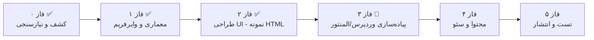

# ۱ — نقشه راه (Roadmap)

> فازبندی پروژه از صفر تا انتشار. هر فاز یک «خروجی قابل تحویل» و «معیار Done» دارد.

> **آخرین وضعیت (۱۴۰۵/۰۶/۲۸ — 2026-09-19):** فازهای ۰، ۱ و ۲ ✅ تکمیل شده‌اند. نمونه UI (فایل‌های HTML در ریشه مخزن) توسط کارفرما تأیید شد و **پیاده‌سازی در Figma کنسل شد** — کار مستقیم روی وردپرس/المنتور انجام می‌شود. اکنون در **فاز ۳ (پیاده‌سازی)** هستیم؛ جزئیات در `07-scenario.md`.

---

## ۱. نمای کلی فازها

---

## ۲. جدول فازها

| فاز | عنوان | هدف | خروجی | مسئول اصلی | معیار Done | وضعیت |
|-----|-------|-----|-------|-----------|------------|-------|
| ۰ | کشف و نیازسنجی | شفاف‌سازی هدف، مخاطب، رقبا | تکمیل `00-overview.md` و `04-content-map.md` | مالک | همه TODOهای فاز ۰ بسته شود | ✅ تکمیل |
| ۱ | معماری و وایرفریم | ساختار اطلاعات و چیدمان صفحات | `05-site-architecture.md` + نمونه‌های HTML ریشه مخزن | طراح | تأیید نقشه سایت و چیدمان | ✅ تکمیل |
| ۲ | طراحی UI | پیاده‌سازی ظاهر نهایی | `06-design-system.md` + نمونه UI به‌صورت HTML/CSS (`index.html`, `about.html`, `courses.html`, `course.html`, `contact.html`, `blog.html`, `landing.html`, `dashboard.html`, …) | طراح | تأیید سیستم طراحی و نمونه UI توسط کارفرما | ✅ تکمیل — تأیید کارفرما (Figma کنسل شد) |
| ۳ | پیاده‌سازی | ساخت سایت واقعی در وردپرس/المنتور | سایت نصب‌شده با صفحات کامل | توسعه‌دهنده | مطابقت با نمونه UI و قواعد | 🔄 در حال اجرا — نصب و المنتور آماده؛ صفحه اصلی در حال طراحی |
| ۴ | محتوا و سئو | تولید محتوای نهایی و بهینه‌سازی | محتوای بارگذاری‌شده + تنظیمات سئو | مالک/ادیتور | تکمیل چک‌لیست سئو | ⏳ |
| ۵ | تست و انتشار | رفع اشکال و راه‌اندازی | سایت آنلاین | توسعه‌دهنده | تأیید `08-launch-checklist.md` | ⏳ |

### پیشرفت فاز ۳ (خلاصه از `07-scenario.md`)

- [x] ۳.۱ نصب و پیکربندی پایه وردپرس
- [x] ۳.۲ راه‌اندازی المنتور، رنگ‌ها/فونت‌های سراسری، Header و Footer *(قالب تکی/آرشیو دوره به بخش صفحات دوره منتقل شد)*
- [ ] ۳.۳ ساخت صفحات اصلی — 🔄 صفحه اصلی (`/`) در حال طراحی؛ سپس درباره ما، دوره‌ها، خدمات، تماس
- [ ] ۳.۴ توسعه و نصب افزونه اختصاصی [Course-Management](https://github.com/im-jvd2/Course-Management) (فروش دوره، پنل کاربری) — پس از تکمیل صفحات اصلی
- [ ] ۳.۵ قالب تکی دوره / آرشیو دوره‌ها، پنل کاربری، لندینگ‌ها و تولید محتوای دوره‌ها — پس از نصب افزونه

---

## ۳. زمان‌بندی پیشنهادی (تقریبی)

| فاز | مدت پیشنهادی | شروع | پایان |
|-----|-------------|-------|-------|
| ۰ | ۱ هفته | ✅ | ✅ |
| ۱ | ۱–۲ هفته | ✅ | ✅ |
| ۲ | ۲–۳ هفته | ✅ | ✅ |
| ۳ | ۳–۴ هفته | 🔄 در جریان | ⏳ |
| ۴ | ۱–۲ هفته | ⏳ | ⏳ |
| ۵ | ۱ هفته | ⏳ | ⏳ |

---

## ۴. مایلستون‌ها

> مایلستون‌های گیت‌هاب را با همین فهرست هماهنگ کنید.

- [x] M0 — تأیید برند (نام «مدیکال بیزینس | Medical Business» قطعی شد؛ لوگو طراحی و روی سایت قرار گرفت)
- [x] M1 — تأیید نقشه سایت و چیدمان صفحات (نمونه‌های HTML)
- [x] M2 — تأیید طراحی UI (نمونه UI در ریشه مخزن توسط کارفرما تأیید شد؛ Figma کنسل شد)
- [ ] M3a — تکمیل صفحات اصلی سایت در المنتور
- [ ] M3b — توسعه و نصب افزونه Course-Management روی سایت
- [ ] M3c — تکمیل بخش دوره‌ها و پنل کاربری (سایت کامل در استیج)
- [ ] M4 — بارگذاری کامل محتوا
- [ ] M5 — انتشار عمومی

---

## ۵. وابستگی‌ها و ریسک‌ها

| ریسک | احتمال | اثر | اقدام پیشگیرانه |
|------|--------|-----|-----------------|
| تأخیر در تأیید طراحی و لوگو | — (طراحی و لوگو تأیید شد) | — | ✅ منتفی |
| عدم آمادگی محتوای نهایی صفحات | متوسط | بالا | شروع تولید محتوا موازی با فاز ۳ |
| تأخیر در توسعه افزونه Course-Management | متوسط | بالا | توسعه افزونه موازی با ساخت صفحات اصلی؛ بخش دوره‌ها وابسته به آن است |
| ناهماهنگی بین نمونه UI (HTML) و پیاده‌سازی المنتور | کم | متوسط | استفاده از `06-design-system.md` و فایل‌های HTML ریشه مخزن به‌عنوان مرجع واحد |
