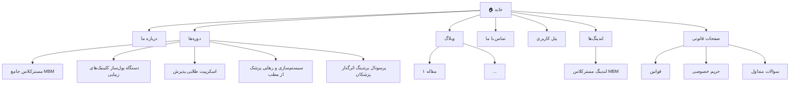
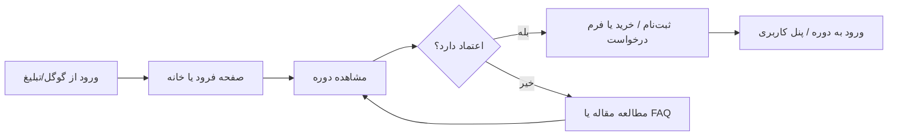

# ۵ — نقشه سایت و معماری اطلاعات

> ساختار کلی سایت: صفحات، ناوبری، و مسیر حرکت کاربر.
> ✅ بر اساس نسخه‌ی دمو/موکاپ استاتیک و داده‌های کارفرما به‌روز شده است.

---

## ۱. درخت صفحات

---

## ۲. ناوبری اصلی (Header)

| آیتم منو | لینک به | ترتیب |
|----------|---------|-------|
| خانه | `/` (`index.html`) | ۱ |
| دوره‌ها | `/courses` (`courses.html`) | ۲ |
| درباره ما | `/about` (`about.html`) | ۳ |
| وبلاگ | `/blog` (`blog.html`) | ۴ |
| تماس با ما | `/contact` (`contact.html`) | ۵ |

### دکمه‌ی CTA در هدر
- متن: «ورود / ثبت‌نام» (مودال) — برای کاربر مهمان؛ پس از ورود، دسترسی به پنل کاربری.
- لینک پنل: `/dashboard` (`dashboard.html`).

---

## ۳. فوتر (Footer)

- خلاصه‌ی برند: «اولین مرکز تخصصی سیستم‌سازی، رشد فروش و مارکتینگ ۳۶۰ درجه برای پزشکان، دندانپزشکان و صاحبان کلینیک در ایران.»
- لینک‌های سریع: خانه، دوره‌ها، درباره ما، وبلاگ، تماس با ما، پنل کاربری
- لینک دوره‌های پرطرفدار + لینک صفحات قانونی (`terms.html`، `privacy.html`)
- شبکه‌های اجتماعی:
  - اینستاگرام: `https://instagram.com/medicalbusiness.ir`
  - اینستاگرام بنیان‌گذار: `https://instagram.com/Mahdishahnazari541`
  - بله: `https://ble.ir/Medicalbusinesscoach`
  - واتساپ: `https://wa.me/989002991020`
- اطلاعات تماس:
  - تلفن / واتساپ / بله: `09002991020`
  - ایمیل: `info@medicalbusiness.ir` و `support@medicalbusiness.ir`
  - آدرس: اصفهان، خیابان ملاصدرا، مجتمع میامی
  - ساعات کاری: شنبه تا پنجشنبه، ۹ تا ۱۸

---

## ۴. مسیر کاربر (User Journey / Funnel)

> دوره پرچمدار (MBM) از مدل «Application Funnel» استفاده می‌کند: دکمه به‌جای خرید مستقیم، کاربر را به تکمیل فرم درخواست + تماس مشاوره برای پذیرش هدایت می‌کند.

---

## ۵. ساختار URL و سئو

| نوع | الگوی URL |
|-----|-----------|
| صفحه اصلی | `/` |
| دوره (تکی) | `/courses/{slug}` (در موکاپ: `course.html?c=mbm-101` و ...) |
| مقاله | `/blog/{slug}` |
| لندینگ | `/{slug}-landing` یا `/lp/{slug}` (در موکاپ: `landing.html`) |
| قانونی | `/terms`, `/privacy`, `/faq` |

---

## ۶. یادداشت‌های معماری

- ✅ نسخه‌ی دمو (موکاپ) استاتیک است و داده‌ها در `assets/js/data.js` نگهداری می‌شوند؛ ورود/ثبت‌نام و خرید با `localStorage` شبیه‌سازی شده است.
- ⏳ تصمیم سیستم فروش دوره در وردپرس: LMS (مثل LearnDash) یا ووکامرس یا لندینگ + فرم — هنوز باز است.
- ⏳ صفحه‌ی حساب کاربری در وردپرس باید با پنل دمو (`dashboard.html`) هم‌تراز شود.
