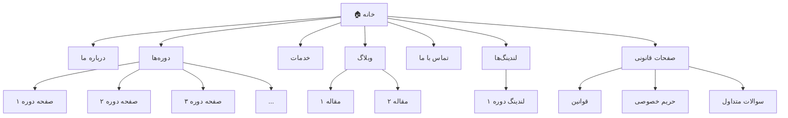
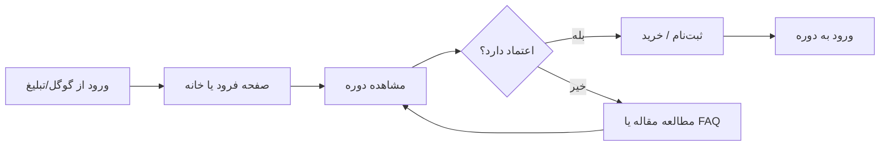

# ۵ — نقشه سایت و معماری اطلاعات

> ساختار کلی سایت: صفحات، ناوبری، و مسیر حرکت کاربر.

---

## ۱. درخت صفحات

---

## ۲. ناوبری اصلی (Header)

| آیتم منو | لینک به | ترتیب |
|----------|---------|-------|
| خانه | `/` | ۱ |
| دوره‌ها | `/courses` | ۲ |
| خدمات | `/services` | ۳ |
| وبلاگ | `/blog` | ۴ |
| درباره ما | `/about` | ۵ |
| تماس با ما | `/contact` | ۶ |

### دکمه‌ی CTA در هدر
- متن: ⏳ TODO — (مثلاً «مشاهده دوره‌ها»)
- لینک: `/courses`

---

## ۳. فوتر (Footer)

- خلاصه‌ی برند + توضیح کوتاه
- لینک‌های سریع (دوره‌ها، درباره، وبلاگ، تماس)
- لینک صفحات قانونی (قوانین، حریم خصوصی)
- شبکه‌های اجتماعی ⏳ TODO
- اطلاعات تماس ⏳ TODO

---

## ۴. مسیر کاربر (User Journey / Funnel)

---

## ۵. ساختار URL و سئو

| نوع | الگوی URL |
|-----|-----------|
| صفحه اصلی | `/` |
| دوره (تکی) | `/courses/{slug}` |
| مقاله | `/blog/{slug}` |
| لندینگ | `/{slug}-landing` یا `/lp/{slug}` |
| قانونی | `/terms`, `/privacy`, `/faq` |

---

## ۶. یادداشت‌های معماری

- ⏳ TODO — تصمیم درباره‌ی سیستم فروش دوره: LMS (مثل LearnDash) یا ووکامرس یا لندینگ + فرم.
- ⏳ TODO — تصمیم درباره‌ی صفحه‌ی حساب کاربری و ورود/ثبت‌نام.
