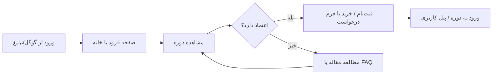

# ۵ — نقشه سایت و معماری اطلاعات

> ساختار کلی سایت: صفحات، ناوبری، و مسیر حرکت کاربر.
> ✅ بر اساس نمونه UI تأییدشده (HTML استاتیک در ریشه مخزن) و داده‌های کارفرما به‌روز شده است.
> 🔄 **وضعیت پیاده‌سازی (۱۴۰۵/۰۷/۰۶):** خانه، خدمات، درباره ما، آرشیو وبلاگ و تماس با ما در المنتور ✅ تکمیل شد.

---

## ۱. درخت صفحات

```mermaid
flowchart TD
    Home[🏠 خانه] --> About[درباره ما]
    Home --> Courses[دوره‌ها]
    Home --> Services[خدمات]
    Home --> Blog[وبلاگ]
    Home --> Contact[تماس با ما]
    Home --> Dashboard[پنل کاربری]
    Courses --> MBM[مسترکلاس جامع MBM]
    Courses --> AES[دستگاه پول‌ساز کلینیک‌های زیبایی]
    Courses --> RCP[اسکریپت طلایی پذیرش]
    Courses --> SOP[سیستم‌سازی و رهایی پزشک از مطب]
    Courses --> BRD[پرسونال برندینگ اثرگذار پزشکان]
    Services --> SvcRequest[فرم درخواست مشاوره رایگان]
    Blog --> Post[📝 ۹ مقاله - قالب تکی واحد<br/>نمونه UI: post.html]    Home --> Landing[لندینگ‌ها]
    Landing --> LP1[لندینگ مسترکلاس MBM]
    Home --> Legal[صفحات قانونی]
    Legal --> Terms[قوانین]
    Legal --> Privacy[حریم خصوصی]
    Legal --> FAQ[سوالات متداول]
```

---

## ۲. ناوبری اصلی (Header)

| آیتم منو | لینک به | ترتیب |
|----------|---------|-------|
| خانه | `/` (`index.html`) | ۱ |
| دوره‌ها | `/courses` (`courses.html`) | ۲ |
| خدمات | `/services` (`services.html`) | ۳ |
| درباره ما | `/about` (`about.html`) | ۴ |
| وبلاگ | `/blog` (`blog.html`) | ۵ |
| تماس با ما | `/contact` (`contact.html`) | ۶ |

> صفحه‌ی خدمات (۵ خدمت تخصصی) پیش از این فقط به‌صورت سکشن در صفحه اصلی وجود داشت؛ اکنون صفحه‌ی مستقل `/services` هم ساخته شده است (نمونه UI: `services.html`، راهنمای المنتور: [`09-services-page.md`](09-services-page.md)).

### دکمه‌ی CTA در هدر
- متن: «ورود / ثبت‌نام» (مودال) — برای کاربر مهمان؛ پس از ورود، دسترسی به پنل کاربری.
- لینک پنل: `/dashboard` (`dashboard.html`) — در وردپرس توسط افزونه [Course-Management](https://github.com/im-jvd2/Course-Management) ارائه می‌شود.

---

## ۳. فوتر (Footer)

- خلاصه‌ی برند: «اولین مرکز تخصصی سیستم‌سازی، رشد فروش و مارکتینگ ۳۶۰ درجه برای پزشکان، دندانپزشکان و صاحبان کلینیک در ایران.»
- لینک‌های سریع: خانه، دوره‌ها، درباره ما، وبلاگ، تماس با ما، پنل کاربری، سوالات متداول (`/faq`)
- لینک دوره‌های پرطرفدار + لینک صفحات قانونی (`terms.html`، `privacy.html`)
- شبکه‌های اجتماعی:
  - اینستاگرام: `https://instagram.com/medicalbusiness.ir`
  - اینستاگرام بنیان‌گذار: `https://instagram.com/Mahdishahnazari541`
  - بله: `https://ble.ir/Medicalbusinesscoach`
  - واتساپ: `https://wa.me/989002991020`
- اطلاعات تماس:
  - تلفن / واتساپ / بله: `09002991020`
  - ایمیل: `info@medicalbusiness.ir` و `support@medicalbusiness.ir`
  - آدرس: اصفهان، خیابان ملاصدرا، مجتمع میامی
  - ساعات کاری: شنبه تا پنجشنبه، ۹ تا ۱۸

---

## ۴. مسیر کاربر (User Journey / Funnel)

```mermaid
flowchart LR
    A[ورود از گوگل/تبلیغ] --> B[صفحه فرود یا خانه]
    B --> C[مشاهده دوره]
    C --> D{اعتماد دارد؟}
    D -- بله --> E[ثبت‌نام / خرید یا فرم درخواست]
    D -- خیر --> F[مطالعه مقاله یا FAQ]
    F --> C
    E --> G[ورود به دوره / پنل کاربری]
```

> دوره پرچمدار (MBM) از مدل «Application Funnel» استفاده می‌کند: دکمه به‌جای خرید مستقیم، کاربر را به تکمیل فرم درخواست + تماس مشاوره برای پذیرش هدایت می‌کند.

---

## ۵. ساختار URL و سئو

| نوع | الگوی URL |
|-----|-----------|
| صفحه اصلی | `/` |
| دوره (تکی) | `/courses/{slug}` (در نمونه UI: `course.html?c=mbm-101` و ...) |
| مقاله | `/blog/{slug}` |
| لندینگ | `/{slug}-landing` یا `/lp/{slug}` (در نمونه UI: `landing.html`) |
| قانونی | `/terms`, `/privacy`, `/faq` |

---

## ۶. یادداشت‌های معماری

- ✅ نمونه UI استاتیک است و داده‌ها در `assets/js/data.js` نگهداری می‌شوند؛ ورود/ثبت‌نام و خرید با `localStorage` شبیه‌سازی شده است.
- ✅ **تصمیم قطعی — سیستم فروش و پنل کاربری:** افزونه وردپرسی اختصاصی **[Course-Management](https://github.com/im-jvd2/Course-Management)** (مخزن جداگانه) مسئول فروش دوره، ثبت‌نام/ورود، پنل کاربری (دوره‌های من، سفارش/فاکتور، علاقه‌مندی، تیکت، پروفایل) و مدیریت دوره‌هاست. WooCommerce/LMS استفاده نمی‌شود.
- ✅ صفحه‌ی حساب کاربری (`/dashboard`) در وردپرس توسط این افزونه ارائه می‌شود و باید با نمونه UI (`dashboard.html`) هم‌تراز باشد.
- ✅ دکمه‌های «خرید و ثبت‌نام در دوره» به فرآیند افزونه Course-Management متصل می‌شوند (کاربر مهمان → مودال ورود → افزودن دوره به پنل).

### ترتیب پیاده‌سازی بخش دوره‌ها

1. ✅ تکمیل صفحات اصلی سایت در المنتور (خانه، درباره ما، خدمات، تماس، آرشیو وبلاگ — ۱۴۰۵/۰۷/۰۶). تکمیل وبلاگ (۹ مقاله + قالب نوشته‌ی تکی): [`10-blog-articles.md`](10-blog-articles.md).
2. توسعه افزونه Course-Management و نصب آن روی سایت اصلی.
3. سپس: طراحی قالب تکی دوره و آرشیو دوره‌ها، صفحات پنل کاربری، اتصال خرید و تولید محتوای دوره‌ها.
