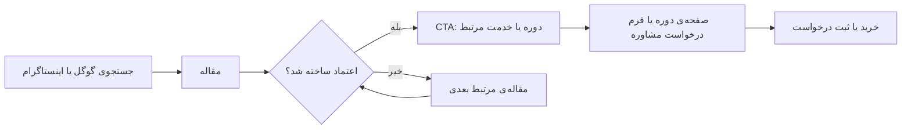

# ۱۰ — وبلاگ: ۹ مقاله‌ی واقعی + قالب نوشته‌ی تکی (مشخصات و راهنمای پیاده‌سازی)

> این سند «مشخصات کامل مرحله‌ی فعلی فاز ۳» است: بریف تولید **۹ مقاله‌ی واقعی و سئوشده**، نقشه‌ی **لینک‌سازی داخلی** و راهنمای ساخت **قالب نوشته‌ی تکی (Single Post)** در المنتور.
> مرجع بصری آرشیو وبلاگ: **`blog.html`** در ریشه‌ی مخزن — ✅ صفحه‌ی آرشیو (`/blog`) در المنتور تکمیل شده است.
> وضعیت: 🔄 **در حال اجرا** — ۱۴۰۵/۰۷/۰۶ (2026-09-28)

---

## ۱. وضعیت و هدف

| مورد | وضعیت |
|------|-------|
| صفحات اصلی (خانه، خدمات، درباره ما، تماس با ما، آرشیو وبلاگ) | ✅ در المنتور تکمیل شد (۱۴۰۵/۰۷/۰۶) |
| قالب نوشته‌ی تکی مقاله (واحد برای هر ۹ مقاله) | ⏳ ساخته می‌شود — راهنما در §۶ |
| ۹ مقاله‌ی واقعی با داده‌های واقعی و سئوشده | 🔄 در حال تولید — بریف هر مقاله در §۴ |
| لینک‌سازی داخلی (آرشیو + بخش وبلاگ صفحه اصلی + داخل مقالات) | ⏳ طبق نقشه‌ی §۵، هم‌زمان با انتشار مقالات |
| **هدف نهایی** | تبدیل وبلاگ به موتور سئو و قیف ورود: «مقاله ← اعتماد ← CTA دوره/خدمت ← مشتری» |

> **چرا الان؟** صفحات اصلی تکمیل شده‌اند و وبلاگ تنها بخش بازمانده از فاز ۳ است که هم به قالب نیاز دارد (نوشته‌ی تکی) و هم به محتوای واقعی (۹ مقاله). بخش دوره‌ها به‌دلیل وابستگی به افزونه [Course-Management](https://github.com/im-jvd2/Course-Management) طبق `01-roadmap.md` پس از این مرحله است.

---

## ۲. قواعد الزامی مقالات (مطابق `02-rules.md`)

| مورد | قاعده |
|------|-------|
| لحن برند | تخصصی، معتبر، بیزینسی، روان، قاطع، انگیزاننده (`00-overview.md`) |
| حجم هر مقاله | ۱,۲۰۰ تا ۲,۰۰۰ کلمه (هدف دقیق در بریف §۴) |
| تیترها | فقط یک `H1` (= عنوان مقاله)؛ سپس `H2 → H3` بدون پرش |
| خوانایی | پاراگراف‌های ۳–۵ خطی؛ استفاده از لیست، جدول و باکس برای نکات کلیدی |
| کلمه‌ی کلیدی اصلی | در `H1`، متاتایتل، متادسکریپشن، اولین `H2` و پاراگراف اول + پخش طبیعی در متن (بدون Keyword Stuffing) |
| اعداد و تاریخ‌ها | شمسی (در صورت نیاز با معادل میلادی) |
| تصاویر | `alt` توصیفی فارسی، فشرده (WebP ترجیح)، تعیین عرض/ارتفاع |
| نویسنده | مهدی شاهنظری — با باکس نویسنده طبق §۶ |
| CTA | هر مقاله دقیقاً یک CTA اصلی (جدول §۳) + حداکثر یک CTA فرعی |
| لینک داخلی | حداقل ۲ لینک به مقالات دیگر + حداقل ۱ لینک به صفحه‌ی دوره/خدمت مرتبط (§۵) |
| داده‌ها | هر عدد/آمار/مثال باید **واقعی** و به‌تأیید رسیده‌ی مالک باشد؛ ادعاهای عمومی با ارجاع به منبع معتبر |
| اسکیما | `Article` + `BreadcrumbList`؛ در صورت وجود بلوک پرسش‌وپاسخ: `FAQPage` |
| ریتم انتشار | جمعه‌ها — مطابق وعده‌ی «به‌روزرسانی هفتگی» در آرشیو وبلاگ |

---

## ۳. جدول خلاصه‌ی ۹ مقاله (مطابق آرشیو `blog.html`)

| # | عنوان مقاله (H1) | دسته | تاریخ (دمو) | کلیدواژه اصلی | CTA اصلی | حجم هدف |
|---|------------------|------|-------------|---------------|----------|---------|
| ۱ | نقشه‌راه برندسازی شخصی پزشکان؛ از صفحه اینستاگرام تا اتاق ویزیت | برندینگ | ۱۵ شهریور ۱۴۰۵ | برندسازی شخصی پزشکان | دوره پرسونال برندینگ (`brd-501`) | ~۱۸۰۰ |
| ۲ | جذب بیمار از گوگل؛ اصول سئوی محلی برای کلینیک‌ها و مطب‌ها | مارکتینگ | ۸ شهریور ۱۴۰۵ | سئوی محلی کلینیک | خدمت طراحی سایت (`/services#website`) | ~۱۶۰۰ |
| ۳ | تعرفه‌گذاری خدمات درمانی در تورم؛ چطور قیمت را بدون از دست دادن بیمار اصلاح کنیم؟ | فروش | ۱ شهریور ۱۴۰۵ | تعرفه‌گذاری خدمات پزشکی | مسترکلاس MBM (`mbm-101`) | ~۱۵۰۰ |
| ۴ | افزایش بیمار بدون نیاز به تبلیغات بلاگری در اینستاگرام | مارکتینگ | ۲۵ مرداد ۱۴۰۵ | افزایش بیمار دندانپزشکی | دوره دستگاه پول‌ساز (`aes-201`) | ~۱۵۰۰ |
| ۵ | ۵ اشتباه مهلک در مدیریت کلینیک که سود ماهانه را نابود می‌کند | مدیریت | ۱۸ مرداد ۱۴۰۵ | مدیریت مطب دندانپزشکی | رزرو عارضه‌یابی رایگان (`/services#audit`) | ~۱۸۰۰ |
| ۶ | استخدام و آموزش منشی؛ سرمایه‌گذاری که بازگشت آن قطعی است | مدیریت | ۱۰ مرداد ۱۴۰۵ | آموزش منشی کلینیک | دوره اسکریپت طلایی پذیرش (`rcp-301`) | ~۱۶۰۰ |
| ۷ | اینستاگرام پزشکان؛ کدام تبلیغات مجاز است و کدام پرونده‌ساز؟ | مارکتینگ | ۲ مرداد ۱۴۰۵ | تبلیغات مجاز پزشکان | کمپین جذب بیمار (`/services#campaign`) | ~۱۴۰۰ |
| ۸ | تیپ‌شناسی بیماران با مدل DISC؛ کلید فروش تلفنی و تبدیل تماس به نوبت | فروش | ۲۷ تیر ۱۴۰۵ | فروش تلفنی کلینیک | دوره اسکریپت طلایی پذیرش (`rcp-301`) | ~۱۶۰۰ |
| ۹ | داستان برند؛ چطور بیمار با کلینیک شما «احساس» برقرار کند؟ | برندینگ | ۲۰ تیر ۱۴۰۵ | داستان برند کلینیک | دوره پرسونال برندینگ (`brd-501`) | ~۱۴۰۰ |

> وضعیت تولید: هر ۹ مقاله 🔄 در حال تولید (بریف کامل §۴). تاریخ‌ها مطابق نسخه‌ی دمو است؛ استراتژی انتشار واقعی (یکجا یا تدریجی) در §۸ مورد ۴ نیازمند تصمیم کارفرماست.

---

## ۴. بریف کامل هر مقاله

> «متاتایتل» برای تگ عنوان سئو است (≤ ۶۰ کاراکتر)؛ `H1` صفحه همان عنوان کامل جدول §۳ است. متادسکریپشن ≈ ۱۴۰–۱۶۰ کاراکتر. اسلاگ‌ها فارسی و کوتاه پیشنهاد شده‌اند (وردپرس خودکار encode می‌کند)؛ در صورت ترجیح اسلاگ انگلیسی، معادل لاتین انتخاب شود.

### مقاله ۱ — نقشه‌راه برندسازی شخصی پزشکان

| مورد | مقدار |
|------|-------|
| متاتایتل | برندسازی شخصی پزشکان؛ نقشه‌راه ۹۰ روزه |
| متادسکریپشن | برند شخصی برای پزشک دیگر یک امتیاز نیست؛ یک نیاز است. مسیر ۹۰ روزه‌ی ساخت برند شخصی پزشک را از پروفایل اینستاگرام تا اتاق ویزیت، قدم‌به‌قدم با چک‌لیست اجرایی بخوانید. |
| اسلاگ | `/blog/برندسازی-شخصی-پزشکان` |
| کلیدواژه‌ها | اصلی: برندسازی شخصی پزشکان — فرعی: پرسونال برندینگ پزشک، اتوریتی پزشکی، انتخاب اول شدن |
| سرچ اینتنت | راهنمای گام‌به‌گام (How-to) |
| سرفصل‌ها (H2) | ۱) چرا برند شخصی دیگر «امتیاز» نیست؛ «نیاز» است ۲) پنج ستون برند شخصی پزشک: تخصص، پیام، ظاهر، لحن، حضور منظم ۳) گام ۱: پیام برند و جایگاه تخصصی خود را تعریف کنید ۴) گام ۲: اینستاگرام پزشک — از بایو و هایلایت تا تقویم محتوا ۵) گام ۳: محتوای اعتمادساز با فرمول Pulsage ۶) گام ۴: اتاق ویزیت؛ آخرین حلقه‌ی برند ۷) نقشه‌ی ۹۰ روزه + شاخص‌های سنجش ۸) اشتباهات رایج و راه اصلاح |
| لینک‌سازی داخلی | مقالات ۹ و ۷ و ۴ + دوره `brd-501` |
| CTA اصلی | «دوره پرسونال برندینگ اثرگذار پزشکان» → `/courses/brd-501` |
| داده‌ی واقعی موردنیاز | یک نمونه‌ی واقعی (بی‌نام) از مسیر برندسازی یک پزشک + نتیجه‌ی ملموس آن |

### مقاله ۲ — جذب بیمار از گوگل (سئوی محلی)

| مورد | مقدار |
|------|-------|
| متاتایتل | سئوی محلی کلینیک؛ جذب بیمار از گوگل (راهنمای کامل) |
| متادسکریپشن | وقتی بیمار «بهترین دندانپزشک نزدیک من» را جستجو می‌کند، کلینیک شما باید دیده شود. راهنمای عملی سئوی محلی: پروفایل گوگل، صفحات خدمت، نظرات بیمار و سرعت سایت. |
| اسلاگ | `/blog/سئو-محلی-کلینیک` |
| کلیدواژه‌ها | اصلی: سئوی محلی کلینیک — فرعی: جذب بیمار از گوگل، سئو سایت پزشکی، گوگل مپ کلینیک |
| سرچ اینتنت | راهنمای عملی (How-to) |
| سرفصل‌ها (H2) | ۱) بیمار شما چطور در گوگل جستجو می‌کند؟ (سه نوع جستجوی محلی) ۲) پروفایل کسب‌وکار گوگل: راه‌اندازی و بهینه‌سازی گام‌به‌گام ۳) صفحات خدمت و صفحه‌ی شهر؛ اسکلت سایت سئو-محلی ۴) نظرات بیمار — مهم‌ترین سیگنال اعتماد (با رعایت اخلاق پزشکی و حریم خصوصی) ۵) سرعت و تجربه‌ی موبایل؛ شرط ورود به نتایج جستجو ۶) محتوای محلی وبلاگ؛ سوخت رشد پایدار ۷) چک‌لیست نهایی سئوی محلی کلینیک |
| لینک‌سازی داخلی | مقالات ۴ و ۷ + `/services#website` |
| CTA اصلی | «دریافت پیشنهاد طراحی سایت» → `/services#website` |
| داده‌ی واقعی موردنیاز | نمونه جستجوهای واقعی بازار ایران (در صورت وجود داده‌ی سرچ‌کنسول) |

### مقاله ۳ — تعرفه‌گذاری خدمات درمانی در تورم

| مورد | مقدار |
|------|-------|
| متاتایتل | تعرفه‌گذاری خدمات درمانی در تورم؛ راهنمای اصلاح قیمت |
| متادسکریپشن | با تورم، هزینه‌های مطب بالا می‌رود اما ترس از افزایش قیمت حاشیه سود را آب می‌کند. روش اصلاح تعرفه‌های خدمات درمانی بدون شوک به بیمار — با مثال کلینیک‌های ایرانی. |
| اسلاگ | `/blog/تعرفه-گذاری-خدمات-درمانی` |
| کلیدواژه‌ها | اصلی: تعرفه‌گذاری خدمات پزشکی — فرعی: قیمت‌گذاری خدمات دندانپزشکی، افزایش قیمت بدون از دست دادن بیمار، قیمت‌گذاری پرستیژی |
| سرچ اینتنت | حل مسئله |
| سرفصل‌ها (H2) | ۱) چرا «نرفتن بالای قیمت» گران‌ترین تصمیم مدیریت است؟ ۲) قیمت‌گذاری بر پایه‌ی ارزش، نه بر پایه‌ی هزینه ۳) مدل‌های قیمت‌گذاری پرستیژی برای خدمات درمانی ۴) چهار مسیر اصلاح تعرفه بدون شوک: بسته‌بندی، لایه‌بندی خدمت، افزایش پلکانی، ارتباط شفاف ۵) مدیریت اعتراض «خیلی گرونه!» در پذیرش ۶) اشتباهات رایج تعرفه‌گذاری (جنگ تخفیف، تخفیف پنهان و…) |
| لینک‌سازی داخلی | مقالات ۸ و ۵ + دوره `mbm-101` |
| CTA اصلی | «مسترکلاس جامع MBM» (جلسه‌ی قیمت‌گذاری پرستیژی) → `/courses/mbm-101` |
| داده‌ی واقعی موردنیاز | مثال واقعی اصلاح تعرفه در یک مجموعه + نتیجه (تأیید مالک) |

### مقاله ۴ — افزایش بیمار بدون تبلیغات بلاگری

| مورد | مقدار |
|------|-------|
| متاتایتل | افزایش بیمار بدون تبلیغات بلاگری؛ سیستم جذب هدفمند |
| متادسکریپشن | برای پر کردن تایم‌های خالی مطب لازم نیست بلاگر بگیرید یا فالوور بخرید. با سیستم محتوای درست و قیف اعتمادسازی، بیمار هدفمند جذب کنید — بدون جنگ تخفیف. |
| اسلاگ | `/blog/افزایش-بیمار-بدون-تبلیغات-بلاگری` |
| کلیدواژه‌ها | اصلی: افزایش بیمار دندانپزشکی — فرعی: جذب بیمار زیبایی، بازاریابی کلینیک زیبایی، تبلیغات کلینیک |
| سرچ اینتنت | راهنما |
| سرفصل‌ها (H2) | ۱) چرا تبلیغ بلاگری اغلب بازگشت سرمایه ندارد؟ (ریاضیات ساده‌ی یک همکاری) ۲) قیف جذب بیمار: از دیده‌شدن تا نوبت قطعی ۳) محتوای اعتمادساز با فرمول Pulsage به‌جای محتوای تبلیغی ۴) کمپین بازگشت بیمار؛ ارزان‌ترین بیمار، بیمار قبلی است ۵) سنجش هزینه‌ی جذب هر بیمار (CAC) — عددی که همه‌چیز را روشن می‌کند ۶) چک‌لیست جایگزین‌های تبلیغ بلاگری |
| لینک‌سازی داخلی | مقالات ۲ و ۶ + دوره `aes-201` |
| CTA اصلی | «دوره دستگاه پول‌ساز کلینیک‌های زیبایی» → `/courses/aes-201` |
| داده‌ی واقعی موردنیاز | مقایسه‌ی واقعی CAC در کمپین‌ها (تأیید مالک) |

### مقاله ۵ — ۵ اشتباه مهلک در مدیریت کلینیک

| مورد | مقدار |
|------|-------|
| متاتایتل | ۵ اشتباه مهلک مدیریت کلینیک که سود را نابود می‌کند |
| متادسکریپشن | از وابستگی کامل به حضور پزشک تا نبود سیستم پذیرش؛ پنج اشتباه رایج که بی‌سروصدا درآمد کلینیک را می‌خورند — و راه اصلاح دقیق هر کدام با چک‌لیست اجرایی. |
| اسلاگ | `/blog/اشتباهات-مدیریت-کلینیک` |
| کلیدواژه‌ها | اصلی: مدیریت مطب دندانپزشکی — فرعی: سیستم‌سازی مطب، مدیریت کلینیک، سوددهی کلینیک |
| سرچ اینتنت | فهرست آگاهی‌بخش (Listicle) |
| سرفصل‌ها (H2) | ۱) اشتباه ۱: وابستگی صددرصدی درآمد به حضور فیزیکی پزشک ۲) اشتباه ۲: نبود SOP و شرح وظایف؛ همه‌چیز در حافظه‌ی آدم‌ها ۳) اشتباه ۳: تیم پذیرش آموزش‌ندیده (درِ ورود درآمد) ۴) اشتباه ۴: مدیریت بدون عدد؛ نداشتن داشبورد مالی و عملکردی ۵) اشتباه ۵: رقابت قیمتی و جنگ تخفیف ۶) راه برون‌رفت: نقشه‌ی سیستم‌سازی در ۹۰ روز |
| لینک‌سازی داخلی | مقالات ۶ و ۳ + دوره `sop-401` + `/services#audit` |
| CTA اصلی | «رزرو جلسه عارضه‌یابی رایگان» → `/services#audit` |
| داده‌ی واقعی موردنیاز | آمار واقعی بهبود یک کلینیک پس از سیستم‌سازی (تأیید مالک) |

### مقاله ۶ — استخدام و آموزش منشی

| مورد | مقدار |
|------|-------|
| متاتایتل | استخدام و آموزش منشی کلینیک؛ راهنمای کامل |
| متادسکریپشن | منشی و تیم پذیرش، اولین نقطه‌ی تماس بیمار با برند شما هستند. راهنمای کامل استخدام، گزینش، آموزش و ارزیابی منشی کلینیک — با سوالات مصاحبه و چک‌لیست آن‌بردینگ. |
| اسلاگ | `/blog/استخدام-و-آموزش-منشی-کلینیک` |
| کلیدواژه‌ها | اصلی: آموزش منشی کلینیک — فرعی: استخدام منشی مطب، آموزش پذیرش، شرح وظایف منشی |
| سرچ اینتنت | راهنمای عملی (How-to) |
| سرفصل‌ها (H2) | ۱) چرا منشی، «مدیرعامل خط مقدم» کلینیک است؟ ۲) چه کسی را استخدام کنیم؟ پروفایل منشی ستاره ۳) فرآیند گزینش: سوالات کلیدی مصاحبه + تمرین عملی ۴) آن‌بردینگ: هفته‌ی اول تا روز سی‌ام (چک‌لیست) ۵) استاندارد پاسخگویی: اسکریپت تلفنی و پیگیری ۶) ارزیابی عملکرد و پاداش؛ نگه‌داشتن نیروی خوب |
| لینک‌سازی داخلی | مقالات ۸ و ۵ + دوره `rcp-301` + `/services#reception` |
| CTA اصلی | «دوره اسکریپت طلایی پذیرش» → `/courses/rcp-301` |
| داده‌ی واقعی موردنیاز | نمونه‌ی واقعی شرح شغل و چک‌لیست آن‌بردینگ |

### مقاله ۷ — تبلیغات مجاز پزشکان در اینستاگرام ⚠️

| مورد | مقدار |
|------|-------|
| متاتایتل | تبلیغات مجاز پزشکان در اینستاگرام؛ چک‌لیست کامل |
| متادسکریپشن | مرز باریک بین «معرفی خدمت» و «تخلف تبلیغاتی» را بشناسید تا صفحه‌ای که سال‌ها ساختید یک‌شبه تعلیق نشود. چک‌لیست پیش از انتشار هر پست + اقدامات لازم پس از اخطار. |
| اسلاگ | `/blog/تبلیغات-مجاز-پزشکان-اینستاگرام` |
| کلیدواژه‌ها | اصلی: تبلیغات مجاز پزشکان — فرعی: قوانین تبلیغات پزشکی، اخلاق پزشکی در فضای مجازی |
| سرچ اینتنت | آگاهی/رعایت قانون — **حساس از نظر حقوقی** |
| سرفصل‌ها (H2) | ۱) چرا این موضوع برای پزشکان «پرونده‌ساز» است؟ ۲) مرز «معرفی خدمت» و «تخلف تبلیغاتی» کجاست؟ ۳) محتوای کم‌ریسک: آموزش، تجربه، معرفی عمومی خدمات ۴) محتوای پرریسک: وعده‌ی نتیجه، قبل/بعد، القای نیاز، القاب اغراق‌آمیز ۵) چک‌لیست ۸ موردی قبل از انتشار هر پست ۶) اگر اخطار/تعلیق گرفتیم چه کنیم؟ |
| لینک‌سازی داخلی | مقالات ۱ و ۴ + `/services#campaign` |
| CTA اصلی | «کمپین وفادارسازی و جذب بیمار» → `/services#campaign` |
| داده‌ی واقعی موردنیاز | استناد به ضوابط رسمی نظارت پزشکی + بازبینی نهایی مالک (§۸ مورد ۳) |

### مقاله ۸ — تیپ‌شناسی بیماران با مدل DISC

| مورد | مقدار |
|------|-------|
| متاتایتل | تیپ‌شناسی بیماران با DISC؛ کلید فروش تلفنی کلینیک |
| متادسکریپشن | هر بیمار با زبان متفاوتی «بله» می‌گوید. با شناخت چهار تیپ شخصیتی DISC، تیم پذیرش شما یاد می‌گیرد در همان تماس اول جمله‌ی درست را بگوید و تماس استعلام را به نوبت قطعی برساند. |
| اسلاگ | `/blog/تیپ-شناسی-بیماران-disc` |
| کلیدواژه‌ها | اصلی: فروش تلفنی کلینیک — فرعی: تیپ‌شناسی DISC، تبدیل تماس به نوبت، آموزش منشی کلینیک |
| سرچ اینتنت | آموزشی |
| سرفصل‌ها (H2) | ۱) چرا یک اسکریپت ثابت برای همه‌ی بیماران کار نمی‌کند؟ ۲) چهار تیپ DISC در یک تماس تلفنی: نشانه‌ها و رفتار ۳) تیپ D (قاطع و نتیجه‌محور): چطور پاسخ دهیم ۴) تیپ I (روگیر و اجتماعی): چطور پاسخ دهیم ۵) تیپ S (آرام و رابطه‌محور): چطور پاسخ دهیم ۶) تیپ C (دقیق و تحلیل‌گر): چطور پاسخ دهیم ۷) تشخیص تیپ در دو دقیقه‌ی اول + نمونه گفتگوی کامل از «قیمتش چنده؟» تا نوبت قطعی ۸) آموزش این مهارت به تیم پذیرش (تمرین نقش‌آفرینی) |
| لینک‌سازی داخلی | مقالات ۶ و ۳ + دوره `rcp-301` |
| CTA اصلی | «دوره اسکریپت طلایی پذیرش» → `/courses/rcp-301` |
| داده‌ی واقعی موردنیاز | یک مکالمه‌ی واقعی بی‌نام‌سازی‌شده |

### مقاله ۹ — داستان برند

| مورد | مقدار |
|------|-------|
| متاتایتل | داستان برند کلینیک؛ بیمار را درگیر احساس کنید |
| متادسکریپشن | بیمارها تصمیم را با قلب می‌گیرند و با منطق توجیه می‌کنند. ساخت داستان برند (Brand Story) درمانی را با مثال‌های حوزه سلامت بیاموزید و روایت کلینیک خود را بنویسید. |
| اسلاگ | `/blog/داستان-برند-کلینیک` |
| کلیدواژه‌ها | اصلی: داستان برند کلینیک — فرعی: برندینگ کلینیک زیبایی، اعتماد بیمار |
| سرچ اینتنت | آموزشی |
| سرفصل‌ها (H2) | ۱) بیمار کجا «تصمیم» می‌گیرد؟ (قلب یا منطق) ۲) قهرمان داستان شما بیمار است، نه کلینیک ۳) قالب روایت: مشکل ← راهنما ← تحول ۴) کجاها روایت کنیم؟ سایت، اینستاگرام، اتاق انتظار ۵) دو نمونه‌ی خوب و ضعیف از داستان برند درمانی ۶) تمرین عملی: داستان برند کلینیک خود را در ۵ جمله بنویسید |
| لینک‌سازی داخلی | مقالات ۱ و ۴ + دوره `brd-501` |
| CTA اصلی | «دوره پرسونال برندینگ اثرگذار پزشکان» → `/courses/brd-501` |
| داده‌ی واقعی موردنیاز | نمونه‌ی واقعی بازنویسی روایت یک کلینیک |

---

## ۵. نقشه‌ی لینک‌سازی داخلی

### قواعد
- آنکرتکست توصیفی فارسی (نه «اینجا کلیک کنید» و نه تکرار خام کلمه‌ی کلیدی).
- هر مقاله: حداقل ۲ لینک به مقالات دیگر + حداقل ۱ لینک به دوره/خدمت مرتبط (جدول §۴) — **داخل متن**، نه فقط در انتها.
- پس از انتشار هر مقاله‌ی جدید، ۱–۲ مقاله‌ی مرتبط قبلی ویرایش و به مقاله‌ی جدید لینک بگیرند (زنجیره‌سازی).
- لینک داخلی در همان تب باز شود (بدون `target="_blank"`).

### ماتریس لینک‌های داخلی (خلاصه از §۴)

| مقاله | لینک به مقالات | لینک به صفحات |
|-------|----------------|----------------|
| ۱ برندسازی شخصی | ۹، ۷، ۴ | دوره `brd-501` |
| ۲ سئوی محلی | ۴، ۷ | `/services#website` |
| ۳ تعرفه‌گذاری | ۸، ۵ | دوره `mbm-101` |
| ۴ افزایش بیمار بدون بلاگری | ۲، ۶ | دوره `aes-201` |
| ۵ اشتباهات مدیریت | ۶، ۳ | دوره `sop-401` + `/services#audit` |
| ۶ استخدام منشی | ۸، ۵ | دوره `rcp-301` + `/services#reception` |
| ۷ تبلیغات مجاز | ۱، ۴ | `/services#campaign` |
| ۸ تیپ‌شناسی DISC | ۶، ۳ | دوره `rcp-301` |
| ۹ داستان برند | ۱، ۴ | دوره `brd-501` |

### نقاط اتصال آرشیو و صفحه‌ی اصلی (لینک‌سازی در «صفحه مقالات» و «بخش مقالات صفحه اصلی»)

| محل | رفتار |
|-----|-------|
| بخش وبلاگ صفحه اصلی (`/`) | ویجت Posts با **۳ مقاله‌ی آخر** (مرتب بر اساس تاریخ نزولی) + دکمه‌ی «مشاهده همه مقالات» → `/blog` — ساختار فعلی المنتور همین است و با انتشار مقالات به‌صورت خودکار به‌روز می‌شود |
| آرشیو وبلاگ (`/blog`) | کارت هر ۹ مقاله + لینک «ادامه مطلب» به صفحه‌ی تکی + فیلتر دسته + جستجو (رفتار مطابق `blog.html`) |
| کارت مقاله | تصویر شاخص + دسته + تاریخ + عنوان + توضیح کوتاه (هم‌سبک `blog-card` در نمونه UI) |
| مسیر قیف | مقاله ← CTA پایانی ← صفحه‌ی دوره/خدمت ← مودال ورود / فرم درخواست مشاوره |

---

## ۶. قالب نوشته‌ی تکی مقاله (Elementor Theme Builder)

> یک قالب **واحد** برای هر ۹ مقاله (Single Post). مرجع سبک: `06-design-system.md` + الگوی کارت‌ها و `cta-banner` در نمونه UI.

| # | بخش | ویجت‌های المنتور پیشنهادی | نکات اجرا |
|---|-----|---------------------------|-----------|
| ۱ | هدر سایت | قالب سربرگ (Header Template) | همان هدر سایر صفحات |
| ۲ | هیرو مقاله | Container + Breadcrumbs + Post Info + Post Title + Featured Image | بردکرامب (خانه / وبلاگ / دسته)، برچسب دسته، `H1` = عنوان مقاله، ردیف متا: آواتار و نام نویسنده (مهدی شاهنظری + لینک سایت) · تاریخ انتشار شمسی · زمان مطالعه؛ تصویر شاخص تمام‌عرض با نسبت ۱۶:۹ |
| ۳ | چیدمان بدنه | Container دوستونه | ستون اصلی (بدنه، عرض خوانایی ~۷۲۰–۷۶۰px) + ستون کناری چسبان (فهرست مطالب + باکس CTA) — در موبایل تک‌ستونه |
| ۴ | بدنه مقاله | Post Content (Content Widget) | یکان ۱۶–۱۷px / ارتفاع خط ۱.۹؛ `H2`/`H3` با آراد؛ استایل Blockquote و جدول؛ تصاویر وسط‌چین با `alt` و کپشن |
| ۵ | فهرست مطالب (TOC) | Table of Contents یا لیست لنگر دستی | فقط مقالات بالای ۱۲۰۰ کلمه؛ لینک به `H2`ها؛ رعایت `scroll-margin-top` (قاعده‌ی `[id]` در `style.css`) تا تیتر زیر هدر چسبان پنهان نشود |
| ۶ | باکس CTA میانی | کارت دوره: تصویر + عنوان + قیمت + دکمه | بعد از ~۵۰–۶۰٪ مقاله؛ دوره/خدمت مرتبط طبق جدول §۴ |
| ۷ | باکس نویسنده | Author Box | مهدی شاهنظری — آواتار «م‌ش»، نقش، بیو کوتاه، لینک `mahdishahnazari.com` |
| ۸ | مقالات مرتبط | Posts Widget | همان دسته، بدون پست جاری، ۳ کارت هم‌سبک `blog-card` با لینک «ادامه مطلب» |
| ۹ | CTA پایانی | CTA Banner (هم‌سبک `cta-banner`) | متن و مقصد دقیقاً طبق CTA اصلی جدول §۴ |
| ۱۰ | خبرنامه (اختیاری) | فرم خبرنامه | تصمیم در §۸ مورد ۸ |
| ۱۱ | فوتر سایت | قالب پاصفحه (Footer Template) | همان فوتر سایر صفحات |

### تنظیمات قالب
- **Display Conditions:** همه‌ی «Singular → Post» (دسته‌های وبلاگ) — یک قالب واحد.
- **ساختار:** Full Width + هدر/فوتر از Theme Builder؛ فقط توکن‌های رنگ/فونت سراسری (قاعده‌ی `02-rules.md` §۲).
- **سئو:** متاتایتل/توضیحات هر مقاله از بریف §۴ در افزونه‌ی سئو (Rank Math / Yoast — انتخاب نهایی طبق `02-rules.md` هنوز ⏳)؛ اسکیمای `Article` + `BreadcrumbList`؛ `og:image` = تصویر شاخص.
- **دیدگاه‌ها:** پیش‌فرض غیرفعال — تصمیم نهایی §۸ مورد ۶.
- **ریسپانسیو:** TOC و ستون کناری در تبلت/موبایل حذف یا جمع می‌شوند؛ ردیف متا تک‌خطی شود.

---

## ۷. چک‌لیست «Done» این تسک (مطابق `02-rules.md` §۶)

- [ ] قالب تکی طبق §۶ ساخته و با ۲–۳ مقاله‌ی واقعی تست شد
- [ ] هر ۹ مقاله با بریف §۴ تولید و منتشر شد (یک `H1`، ترتیب تیترها، `alt` کامل)
- [ ] متاتایتل/متادسکریپشن + اسکیما (`Article` + `BreadcrumbList`) برای هر مقاله تنظیم شد
- [ ] لینک‌سازی داخلی §۵ اجرا شد و پس از انتشار هر مقاله‌ی جدید به‌روز شد
- [ ] بخش وبلاگ صفحه اصلی ۳ مقاله‌ی آخر و آرشیو همه‌ی مقالات را صحیح نمایش می‌دهند
- [ ] ریسپانسیو موبایل/تبلت/دسکتاپ + PageSpeed (≥۹۰ دسکتاپ / ≥۷۰ موبایل) بررسی شد
- [ ] داده‌های واقعی هر مقاله (§۴) توسط مالک تأیید شده
- [ ] بازبینی نهایی مالک روی محتوا و CTAها

---

## ۸. موارد باز (نیازمند تأیید کارفرما)

| # | مورد | توضیح |
|---|------|-------|
| ۱ | **نویسنده/تولیدکننده‌ی مقالات** | مالک شخصاً می‌نویسد / ادیتور با بازبینی مالک / برون‌سپاری با همین بریف (`docs/10` §۴)؟ |
| ۲ | **داده‌ها و مثال‌های واقعی** | فهرست «داده‌ی واقعی موردنیاز» در §۴ هر مقاله باید توسط مالک تأیید/ارائه شود (با بی‌نام‌سازی مشتریان) |
| ۳ | **بازبینی حقوقی مقاله ۷ (تبلیغات مجاز)** | استناد به ضوابط رسمی نظارت پزشکی + در صورت لزوم مشاوره‌ی حقوقی پیش از انتشار |
| ۴ | **استراتژی انتشار** | یکجا با تاریخ‌های نسخه‌ی دمو (تیر تا شهریور ۱۴۰۵) یا انتشار تدریجی جمعه‌ها؟ — پیشنهاد: تدریجی، مطابق وعده‌ی «به‌روزرسانی هفتگی» |
| ۵ | **تصاویر شاخص** | عکس واقعی / طراحی گرافیکی جدید / استفاده از تصاویر موجود؟ |
| ۶ | **دیدگاه‌ها (Comments)** | فعال یا غیرفعال؟ |
| ۷ | **نمایش زمان مطالعه** | نمایش داده شود یا حذف؟ |
| ۸ | **خبرنامه در پایان مقاله** | باشد یا فقط CTA دوره/خدمت؟ |
| ۹ | **کاربر «نویسنده» در وردپرس** | ساخت کاربر «مهدی شاهنظری» + صفحه‌ی آرشیو نویسنده لازم است یا خیر؟ |

---

## ۹. تغییرات جانبی همین تسک

| فایل | تغییر | دلیل |
|------|-------|------|
| `docs/10-blog-articles.md` | 🆕 فایل جدید (بریف ۹ مقاله + قالب تکی + لینک‌سازی) | نیاز فعلی فاز ۳ — الگوی مستندسازی مطابق `09-services-page.md` |
| `README.md` | وضعیت فاز ۳ (تکمیل صفحات اصلی + تمرکز وبلاگ)، ردیف ۱۰ در فهرست مستندات، درخت ریپو | هم‌خوانی «منبع واحد حقیقت» |
| `docs/01-roadmap.md` | «آخرین وضعیت»، جدول فازها، پیشرفت فاز ۳، مایلستون M3a ✅ + M3a+، ریسک جدید | ثبت پیشرفت |
| `docs/03-planning.md` | جدول وظایف (صفحات اصلی ✅ + دو وظیفه‌ی جدید وبلاگ + رفع placeholder جامانده `"+PLUGIN+"`)، برنامه‌ی هفتگی | ثبت وظایف جاری |
| `docs/04-content-map.md` | یادداشت وضعیت پیاده‌سازی صفحات، جایگزینی جدول ۶ موضوعی قدیمی با جدول نهایی ۹ مقاله | نقشه‌ی محتوایی = آرشیو واقعی |
| `docs/05-site-architecture.md` | درخت سایت (پست‌ها با قالب تکی)، یادداشت معماری، به‌روزرسانی ترتیب پیاده‌سازی | هم‌خوانی معماری |
| `docs/07-scenario.md` | «آخرین وضعیت»، جدول مرحله ۳ (✅ + انتقال آرشیو دوره‌ها)، بخش جدید «تکمیل وبلاگ»، شرط شروع مرحله ۴ | روایت اجرا |
| `docs/08-launch-checklist.md` | دو آیتم جدید در بخش محتوا (۹ مقاله + قالب تکی) | پوشش چک‌لیست انتشار |
| کد و UI | **بدون تغییر** | لینک‌سازی و قالب تکی در وردپرس اجرا می‌شوند؛ دموی استاتیک فقط آرشیو دارد (لینک‌های «ادامه مطلب» در `blog.html` پس از ساخت صفحات تکی وردپرس معنا پیدا می‌کنند) |
